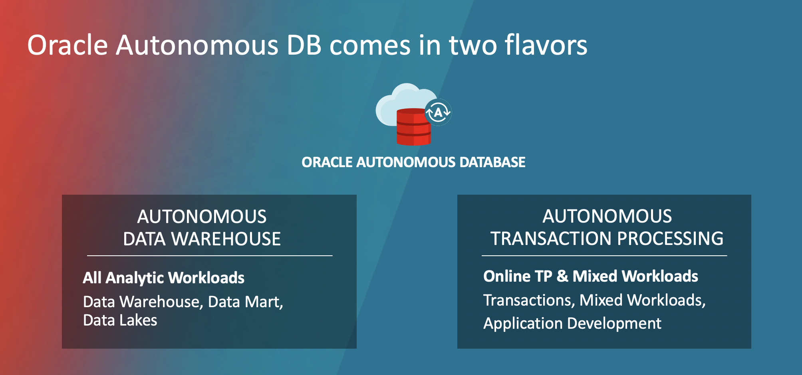
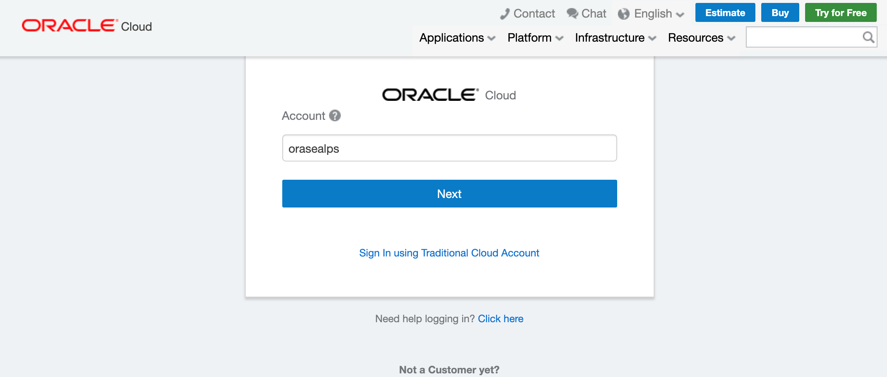
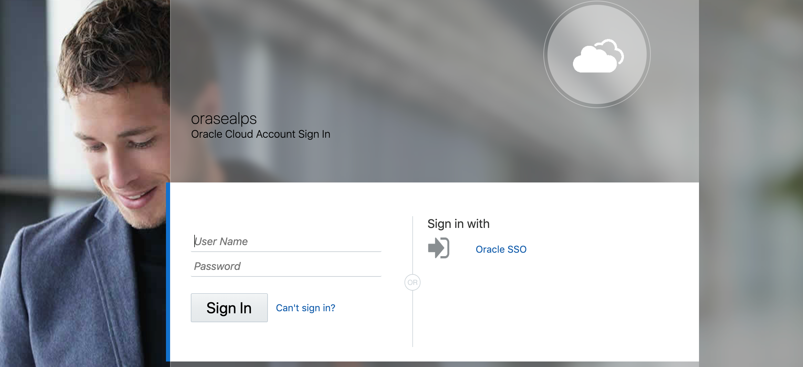
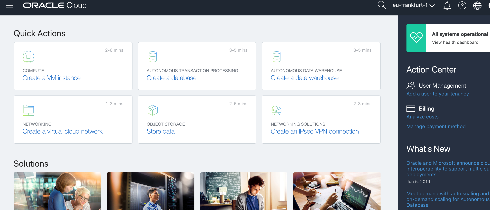
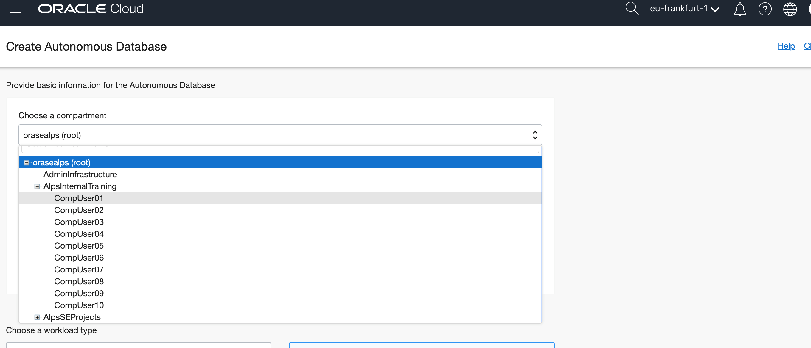
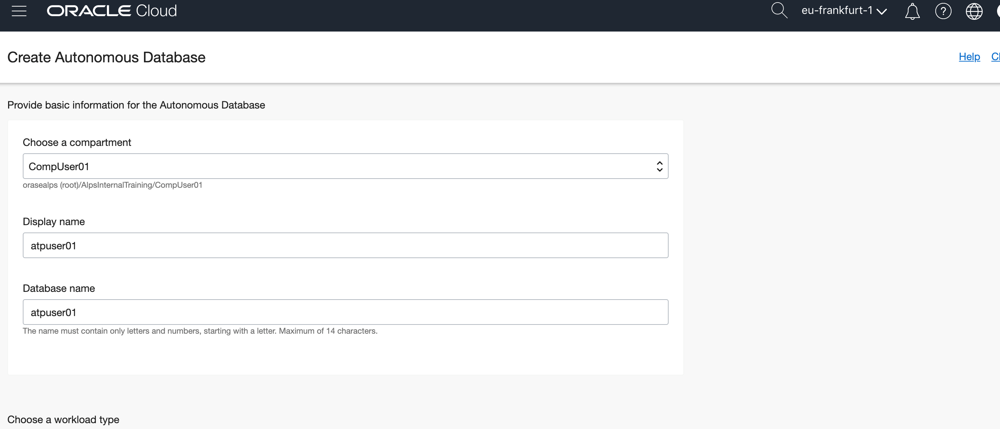
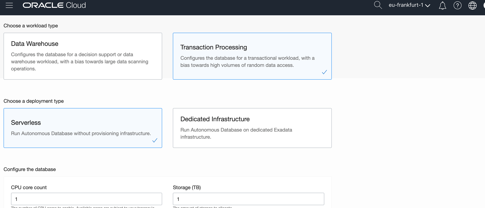
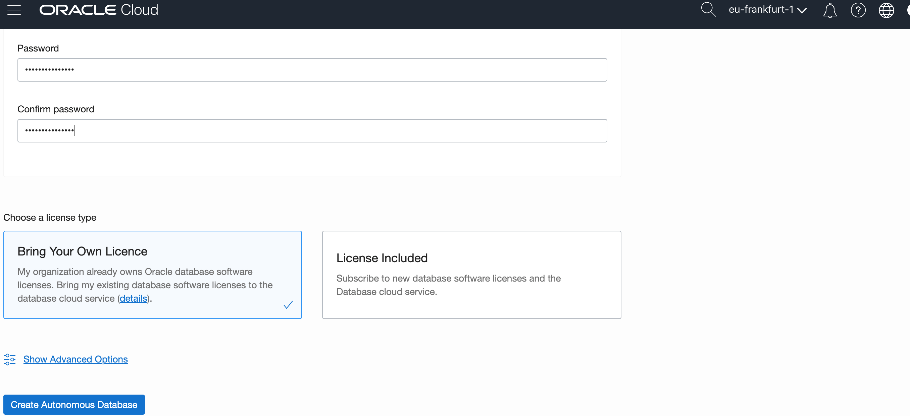

# 🚀 Lab Zero: Provision your first Autonomous DB

Deploy your first Oracle Autonomous DB in less than five minutes.

### What is Oracle Autonomous DB?

With Oracle Autonomous Database Cloud services, you can develop and deploy on a preconfigured, **fully managed, and secured  environment** (database including services like Oracle APEX, Machine Learning notebooks, etc.) without any of the hassles of upkeep or manual maintenance.

Oracle Autonomous Transaction Processing and Autonomous Data Warehouse deliver self-driving, self-securing, self-repairing database services that scale instantly to meet the demands of mission critical applications.

No IT skills required, meaning you don't need to be a database administrator, network engineer, security expert, or systems architect. Oracle takes care of it all, from configuration, tuning, backup, to patching, encryption, scaling and more, so that you can concentrate on solving business problems.

Oracle Autonomous DB comes in two flavors:

### Step-by-step guide

## Step by Step Guide

### Prerequisites

- Oracle Cloud Account
- 5 minutes of time

Head to the [Oracle Cloud login page](https://cloud.oracle.com/en_US/sign-in) and enter your tenancy name.

Enter your login credentials for your tenancy.

From the hamburger menu in the top left, choose `Autonomous Transaction Processing`. The, create a database.

Once done, choose the corresponding compartment.

Choose a display name and database name for ATP instance.

Now you need to choose between

- Autonomous Transaction Processing (ATP) and
- Autonomous Data Warehouse (ADW)

depending on your workload. If you are not sure choose `ATP`. Keep the other pre-selected options (choose `serverless`, leave number of OCPUs and storage as predefined).

Choose a password with strong security for the database instance.

Press `Create Autonomous Database`, this step takes approximately 3-5 minutes. 

Congratulations 🎉. You've now provisioned your first Oracle Autonomous DB. 

Check out our other labs to continue on your learning path.