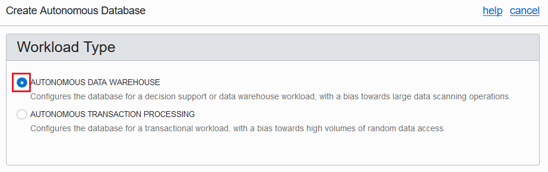
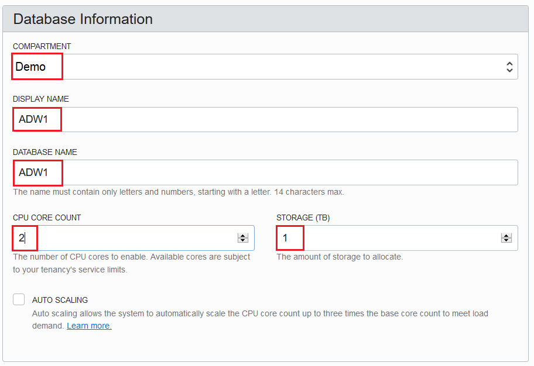
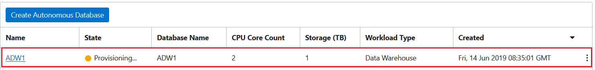
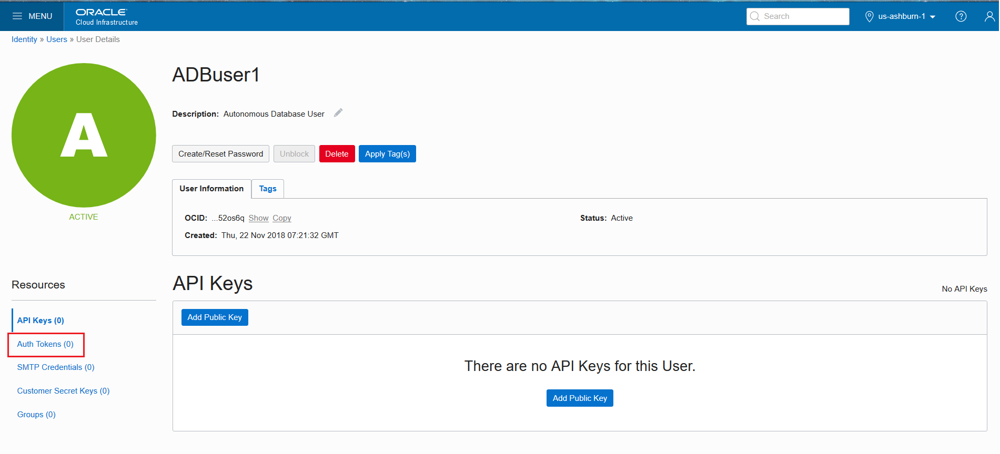
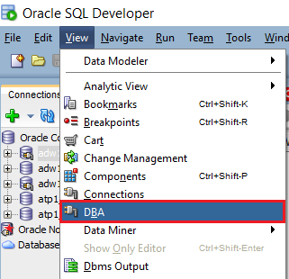
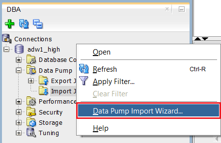
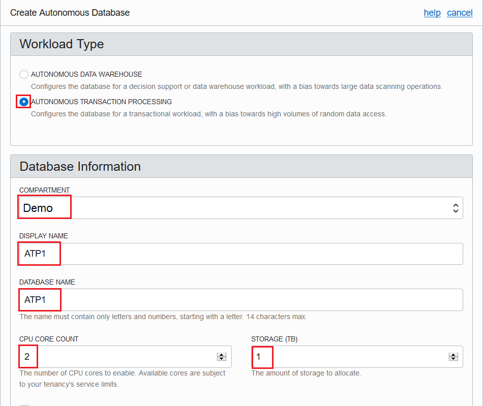
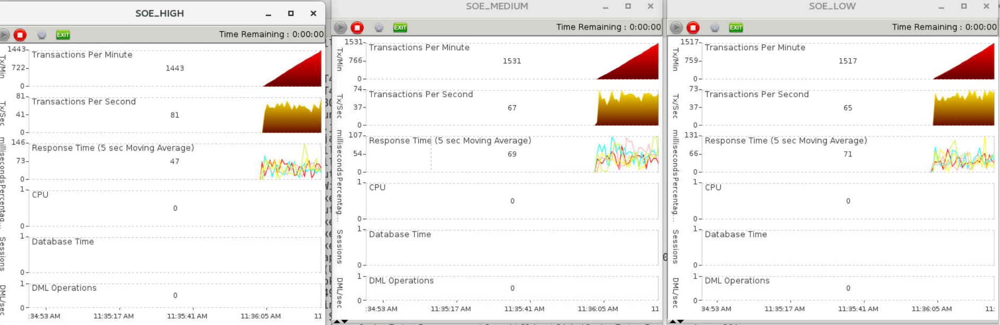

# 🚀 Lab 1: Oracle Autonomous Cloud Scaling (ADW)


## Table of contents

1. [Oracle Autonomous Cloud Services Labs](#oracle-autonomous-cloud-services-labs)
2. [About Autonomous Database Cloud](#about-autonomous-database-cloud)
3. [Prerequisites](#prerequisites)
4. [Autonomous Data Warehouse](#autonomous-data-warehouse)
   1. [Provisioning an ADW service](#provisioning-an-adw-service)
   2. [Connecting to ADW](#connecting-to-adw)
   3. [Creating a new ADB user](#creating-a-new-adw-user)
   4. [Generating Swift Password for Object Storage](#generating-swift-password-for-object-storage)
   5. [Data Loading into Cloud Object Storage](#aata-loading-into-cloud-object-storage)
   6. [Data Loading from Cloud Object Storage to ADW using the SQL Developer Import Wizard](#data-loading-from-cloud-object-storage-to-adw-using-the-sql-developer-import-wizard)
   7. [Connecting to Swingbench](#connecting-to-swingbench)
   8. [Comparing the consumer groups](#comparing-the-consumer-groups)
   9. [Monitoring your ADW instance](#monitoring-your-adw-instance)
   
5. [Autonomous Transaction Processing](#autonomous-transaction-processing)
   1. [Provisioning an ATP service](#provisioning-an-atp-service)
   2. [Connecting to ATP](#connecting-to-atp)
   3. [Creating new ADB user](#creating-new-adb-user)
   4. [Generating Swift Password for Object Storage](#generating-swift-password-for-object-storage)
   5. [Data Loading to Cloud Object Storage](#data-loading-to-cloud-object-storage)
   6. [Data Loading from Cloud Object Storage to ATP using the SQL Developer Import Wizard](#data-loading-from-cloud-object-storage-to-atp-using-the-sql-developer-import-wizard)
   7. [Connecting to Swing bench](#connecting-to-swing-bench)
   8. [Comparing the consumer group](#comparing-the-consumer-group)
   9. [Monitoring your ATP instance](#monitoring-your-atp-instance)

# Oracle Autonomous Cloud Services Labs
   
## Autonomous Data Warehouse Cloud (ADW)
## Autonomous Transaction Processing (ATP)

In this hands-on lab you will get first-hand experience with the Oracle Autonomous Database Cloud. You'll utilize the established, free workload generator "Swingbench", which provides a selection of tailored workload profiles. The sections for ATP and ADW are self-contained and therefor can be executed separately or in combination. You will perform following workloads to exploit service features and to stress the abilities of ADW and ATP: 

-	ATP - Swingbench "OrderEntry" is based on the `oe` demo schema that ships with the Oracle database, it introduces heavy contention on a small number of tables and is designed to stress interconnects and memory. 
-	ADW - Swingbench "SalesHistory" is based on the `sh` demo schema that ships with the Oracle database, it is read-only and designed to test the performance of complicated analytical queries running against large tables.

In a first step, using the Oracle Cloud interface, you will provision the according Autonomous Database and see how you can connect your accustomed tools to your new database. You will make yourself familiar with the service console that enables you to administer and monitor your Autonomous Database(s).

Next, we will upload two Data Pump export files containing the corresponding "on-premise" Swingbench demo schemas into the Oracle Cloud Object Storage.  With the help of the comfortable SQL Developer Import Wizard, we then will import those datasets into your Autonomous database(s).

For the ADW workload, you will start the Swingbench Java client to connect to your ADW instance. You will start with a given number of active users busily executing a customizable set of sophisticated analytic queries (such as cubes, rollups, top-n, moving average) in parallel and observe performance indicators like number of queries executed and average response time. Then by doubling the number of users on the fly you will notice that query statements obviously start queuing since the response time will start to rise alarmingly. You'll solve the situation by scaling the service online and without downtime to bring the response time back within assumed SLA limits. 

For the ATP workload, and before starting the actual workload, you will use Oracle SQL Developer to understand how the provided consumer groups (High, Medium, Low) have been defined and how they will divide up resources. Next, you will start three parallel Swingbench clients, each with a number of users connecting to the distinct consumer groups, stressing the database, deliberately causing contention. You will observe how the users transactions will compete for resources and how the service will prioritize consumer groups according to the resource allocation plan. You then will provide more resources by scaling the service online and without downtime. Since the database now can "breath more freely" and contention is removed, all three consumer groups will benefit - as you will observe with the help of performance indicators like number of transactions executed and average response time.

Concluding the lab, you will cease Swingbench workloads and terminate your Autonomous Databases using the Oracle Cloud console.


## About Autonomous Database Cloud

Oracle's unique autonomous database framework ensures high availability and automatic security - without requiring any additional tasks. Scale as needed - create and expand your database compute and storage capacity on demand and independently of each other with no downtime. Pay only for the resources you consume.  It integrates directly with the full spectrum of business analytics, data integration and IoT services within Oracle's comprehensive range of integrated cloud solutions. All aspects of performance tuning are automatically managed so the service requires no database tuning. 

The Oracle Autonomous Data Warehouse Cloud provides an easy-to-use, fully autonomous database that scales elastically, delivers fast query performance and requires no database administration. It is a fully-managed cloud service that makes it very simple to provision a data warehouse, and to quickly and easily load data and query that data using built-in web-based tools such as notebooks. It delivers high performance data warehousing straight out-of-the-box with unparalleled scalability and reliability. It is built on key Oracle Database capabilities: parallelism, columnar processing and compression. 

Autonomous Transaction Processing provisions mission-critical, scale-out databases and
supports a complex mix of high-performance transactions, but also reporting, batch, IoT, and machine learning in a single database, allowing much simpler application development and deployment.

This is an instructor led lab, please follow the instructor's guidance before doing the exercises. Stop and wait for indications before moving on to the next section. 

## Prerequisites

- Oracle cloud account
- Set of data files
- Oracle SQL Developer
- Swingbench

## Oracle cloud account
You will be allocated with the cloud account details( identity domain, username and password) prior to the start of the workshop. Please check with the instructor for any issues.

## Set the data files
We will use a .dmp file as an example to load it in object store and in turn import the same using SQL Developer. There are two dump files- One for ADW and the other one for ATP. The dumpfiles are zipped and attached below. Please download the zip file and save it in your local repository and unzip the same.

[Download .zip file dumpfiles](https://github.com/alpsteam/autonomous-labs/raw/master/lab-1/Dumpfiles.zip){: .btn .btn-primary .fs-5 .mb-4 .mb-md-0 .mr-2 }

## Oracle SQL Developer
Oracle SQL Developer is a free, integrated development environment that simplifies the development and management of Oracle Database in both traditional and Cloud deployments. SQL Developer offers a worksheet for running queries and scripts, a DBA console for managing the database, a reports interface, a complete data modelling solution, and a migration platform for moving your 3rd party databases to Oracle.

(https://www.oracle.com/technetwork/developer-tools/sql-developer/downloads/index.html)

Make sure to accept the License Agreement or the download option won't appear. 
Then select your appropriate architecture and download.

PLEASE NOTE Mac OS X and Linux: Java SE Development Kit 8u181 is required and can be installed from here (please read SQL Developer installation notes for Max OSX and Linux RPM:


You can download SQL Developer Version 18.4 from OTN (make sure you download the correct version 
for your type of computer and operating system, you can also search for Oracle SQL Developer download if you have problems with the link):

(https://www.oracle.com/technetwork/java/javase/downloads/jdk8-downloads-2133151.html)

## Swingbench
To run swingbench requires 3 components:
-	Unix Bash Shell
-	Java JRE 1.8xx
-	Swingbench (and optional modules)

### Installing Unix Bash Shell:

To run Swingbench on Windows you need to simulate running a Unix shell and that can be done in many ways. This lab uses the Git BASH shell. The latest version of Windows 10 includes this functionality natively but you many need to enable/install it. The steps for getting BASH running will not be covered in this lab but for Windows 10 you can find detailed instructions here:

(https://www.windowscentral.com/how-install-bash-shell-command-line-windows-10)

For older versions of Windows, you can download and install BASH

(https://gitforwindows.org/)

### Installing Java JRE 1.8xx:

Swingbench requires Java 8 to run. You must install it if you don't have it installed. Please notice of you already have SQL Developer running then you have the correct Java installed already. You can test to see if you have it installed by running the following command in command prompt window.

java -version

Java can be downloaded and installed from (pick the appropriate operating system and architecture)

(https://www.oracle.com/technetwork/java/javase/downloads/jdk8-downloads-2133151.html)

### Installing and running Swingbench:

Download swingbench from:

(http://www.dominicgiles.com/downloads.html)

For the section, to run the workload on swingbench and compare between the different consumer groups, you would require an xml file and .sh file. Attached are the files, please download and save it in your local repository.

[Download .zip file lab 1 resources](https://github.com/alpsteam/autonomous-labs/raw/master/lab-1/lab-1-resources.zip){: .btn .btn-primary .fs-5 .mb-4 .mb-md-0 .mr-2 }

## Autonomous Data Warehouse

### Provisioning an ADW service

In this section, you will provision a ADW instance using the UI capabilities of the service.

Note: The cloud credentials such as cloud account name, username and password, will be provided separately to this lab guide by the host. 


1.	Go to cloud.oracle.com and click on Sign In to login to your Oracle cloud account.


2.	Enter the Cloud Account Name provided by the host. In this example, the Cloud Account Name is gse00014613. Click Next


3.	On the login page, fill in the Username and Password for the cloud account. Click Sign In


4.	On the Dashboard page, click on the top-left MENU button, browse through the list of services and click the Autonomous Data Warehouse service.


5.	On the service home page, click Create Autonomous Database to create a new database instance.


6.	Enter the following information in the Create Autonomous Data Warehouse screen:
Workload Type: Select AUTONOMOUS DATA WAREHOUSE



Database Information:
Compartment - Demo
Display Name: ADW<no> - Choose a unique number if multiple attendees are allocated to the same cloud account

Database Name: ADW<no>
Note: Do not use any special characters as the provisioning wizard will not allow you to continue.
CPU Count: 2
Storage Capacity (TB): 1




Administrator Credentials:
Password: Welcome12345
Confirm Password: Welcome12345


License Type: 
Select SUBSCRIBE TO NEW DATABASE SOFTWARE LICENSES AND THE DATABASE CLOUD SERVICE


Click Create Autonomous Database to start provisioning the instance


7.	The new instance is listed on the service home page in the Provisioning State. Monitor it until the state changes to `Available`.



8.	The full set of actions becomes available after the service has been provisioned, typically within approx. 5 minutes


## Connecting to ADW

In this section, you will go through the steps of accessing the credentials for connecting to your ADW instance with external clients, like SQL Developer.

1.	The first step in accessing the credentials is to connect to the DB Connection associated to your ADW instance. In the list of actions, click DB Connection


2.	Click Download


3.	Enter a password before downloading the wallet zip containing the credentials. This password will protect the sensitive data residing in the file. You can use Welcome12345 as the password and then re-type it for confirmation.

Click Download and save the file on your local computer.


4.	Open SQL Developer and Right click on Oracle Connections and click to create a new connection.


5.	Fill in the details to connect to the database as follows: 
             Connection Name: adw1_low 
Username: admin 
Password: Welcome12345 
Connection Type: Cloud Wallet 
Role: default 

Configuration File: Browse to the location of the zipped wallet and select it 
Service: adw1_low 

### If you're connecting from behind a proxy, please enter the proxy host and port settings as directed by the instructor.


6.	If the test is successful, Save the connection and click Connect to access the database.
7.	Create a similar connection adw1_high


## Creating a new ADB user 

In this section, we will create a new ADB user.

1.	From the Oracle Cloud Infrastructure home page, click on the top-left MENU button and navigate to Identity -> Users.  This will display the list of users available on the cloud account.

2.	Click on Create User to create a user


3.	Fill in the following details to create a new user
Name: ADBuser<no> - Choose a unique number if multiple attendees are allocated to the same cloud account
Description: Autonomous Database User
Email: Please provide your email address


Click Create

## Generating Swift Password for Object Storage

Swift is the OpenStack object store service. The Swift Password is a special password that Oracle provides and is associated with your Console user login. These credentials allow you to access data stored in Object Storage.

1.	From the Oracle Cloud Infrastructure home page, click on the top-left MENU button and navigate to Identity -> Users. This will display the list of users available on the cloud account.


2.	In this example, the user is ADBuser1 created in the previous section


3.	On the user details page, on the left menu, click Auth Tokens




4.	To create a new Authentication Token, click Generate Token


5.	First you need to fill in a short description and then click on Generate Token


6.	The resulting password is a string of characters which together with the ADBuser1 will allow you to access the Object Storage. Click Copy and make sure you save it, as this password will no longer be accessible from the UI.


Note: You cannot have more than two tokens generated for a user. If the cloud account hosts more than two attendees, than the tokens should be shared. One option would be for the instructor to generate the token prior to the event and share it with attendees.

## Data Loading into Cloud Object Storage

In this section, you will prepare the Object Storage as an intermediate step to loading the data into the ADW/ATP instance. To do that, you will create a new storage bucket and load the data files into it.

Note: The datafiles are provided in the pre-requisites section. Please download the same and place it your local repository. 

1.	From the Oracle Cloud Infrastructure home page, click on the top-left MENU button and navigate to Object Storage -> Object Storage. This will display the list of buckets available on the Object Storage.


2.	Create a new storage bucket to store your data files. Click Create Bucket.


3.	Fill in ADB_DATA as the bucket name and click Create Bucket.


4.	Click the newly created bucket ADB_DATA


5.	Under the objects section, click Upload Object.


6.	Click Browse and navigate to the location where your data files are saved. (The data files will be provided by the instructor).


7.	Select the file exp_ssh_12M.dmp


8.	Click Upload Objects


9.	Similarly, rest of the files can be uploaded.

Data Loading from Cloud Object Storage to ADW using the SQL Developer Import Wizard

In this section you will load data from the Cloud Object Storage to ADW instance using SQL Developer data import wizard.
Beginning with SQL Developer 18.2 the data import wizard supports loading data from files stored in the Object Store straight into your Autonomous Data Warehouse.

1.	In SQL Developer, open the adw1_low connection and create the credentials to the Object Storage.

```shell
set define off 
begin 
DBMS_CLOUD.create_credential( 
credential_name => 'ADB_CRED', 
username => 'ADBuser1', 
password => '<Swift Password>' 
); 
end;
/

```

2.	In SQL Developer, open the adw1_high connection and create a user ssh and grant dwrole;

```shell
create user ssh identified by Welcome12345;
grant dwrole to ssh;

```


3.	Create a connection for user ssh with below details:

Connection Name: adw1_ssh
Username: ssh
Password: Welcome12345
Connection Type: Cloud Wallet
Configuration file: Browse to the location of the zipped wallet and select it
Service: adw1_high

Note: If you're connecting from behind a proxy, please enter the proxy host and port settings as directed by the instructor.

Click Test to check the connection.


4.	If successful, Click Connect
5.	Click on View in the menu bar and select DBA




6.	Click on the + sign to add a new connection and select adw1_high from the connection list


7.	Expand the adw1_high connection and expand the Data Pump option 


8.	Right click on Import Jobs and click Data Pump Import Wizard



9.	On the import wizard, fill in the following details,

Job Name: import_ssh
Data or DDL: Data and DDL
Type of import: Schemas
Choose Input files -
Credentials or Directories: Select CREDENTIAL: ABD_CRED
File Names and URI: (https://swiftobjectstorage.us-ashburn-1.oraclecloud.com/v1/gse00014613/ADB_DATA/exp_ssh_12M.dmp)


Click Next
The above file names and URI needs to be built by you. 
Login to the object storage on cloud console. Move in to Demo compartment. Select ADB_DATA bucket created earlier.


Inside the ADB_DATA bucket, click on the menu option beside the object exp_ssh_12M.dmp. Click on View Object Details.


The details will pop out a window with the details of the object. Copy the URL Path(URI) and save it. It will be as below:
(https://objectstorage.us-ashburn-1.oraclecloud.com/n/gse00014613/b/ADB_DATA/o/exp_ssh_12M.dmp)
Construct the swift URL link as below:
(https://swiftobjectstorage.us-ashburn-1.oraclecloud.com/v1/<<identity domain>>/<<bucket>>/<<object_name>>)
Replace the identity domain, bucket, object_name from the URL copied above.
The Swift URL would look like: (https://swiftobjectstorage.us-ashburn-1.oraclecloud.com/v1/gse00014613/ADB_DATA/exp_ssh_12M.dmp)
Use the newly constructed Swift URL as File Names and URI.

10.	Select the SSH schema


Click Next

11.	Do not add anything in remapping tab. Click Next


12.	Do not change anything on the options tab. Click Next


13.	Keep the schedule option intact. Click Next


14.	On the summary page, click Finish


15.	On the Import Jobs session, Data pump import can be monitored.


16.	Once the status changes to `NOT RUNNING`, connect to adw1_ssh and execute

```shell
Select count(*) from sales;
```


## Connecting to Swingbench

Swingbench is a free load generator (and benchmarks) designed to stress test an Oracle database.

1.	Launch the swingbench client 


2.	Select Sales_History as the Configuration File and click OK


3.	Fill in the following details to connect ssh user in ADW instance

Username: ssh
Password: Welcome12345
Connect String: adw1_high
Credential File: Browse to the wallet file generated for ADW instance

Note: We would first connect to the `adw1_high` consumer group with highest resource utilization.


Click Connect
4.	On successful connection, a message will pop out. Click OK


5.	In the upper right section, we have a mix of analytical query that are executed by a number of users. Example, roll outs, moving averages, top lists etc. You can switch the queries ON/OFF and change the load ratios.


6.	Once connected, click on the Properties tab. Click on the + symbol in the Connection Initialisation Commands and enter

Alter session set sql_trace = false


7.	On the Configuration tab, Select the number of users as 4 to bombard the instance with analytical queries. Click on the Run sign to start the benchmarking.


8.	The transaction will start to ramp up. The below screenshot is sample output at a certain point in time.


The chart shows the information about transactions per minute, transactions per second, response time and the DML operations being executed for 4 users. The current average time shows as ~5 seconds. 

Now we will look at the benchmarking chart with 8 users. Increase the count of users to 8.


Below is a screenshot of chart taken at a certain point in time.


You can see that with the addition of more users, 1 OCPU (and amount of memory associated) is insufficient. Average response time has gone up and the number of transactions per minutes have reduced.
To handle this workload, let us add more CPU  (and associated memory) to the ADW instance.
ADW allows the users to scale up compute and storage individually without any downtime. 

9.	Connect to the ADW1 instance. Click on Scale Up/Down


10.	Increase the CPU count from 1 to 3 OCPUs. Click Update


You also have the option to auto scale where the resources will be auto allocated up to three times the base count to meet the workload. As part of this workshop, we won't enable the auto scaling option.

11.	Scaling is in progress


Once the scaling is complete, we will now review the Swingbench benchmark with 3 OCPUs and 8 users.
The below screenshot has been taken a certain point in time.


We could see the response time have also come down drastically. The number of transactions is mounting again. 

Note: Please scale down the CPU to 1 again to save resources.

## Comparing the consumer groups

High, Medium and Low are the three different consumer groups associated with an Autonomous Database instance.

The basic characteristics of the consumer groups are as below:

HIGH
- Highest resources, lowest concurrency
- Queries run in parallel

MEDIUM
- Less resources, higher concurrency
- Queries run in parallel 

LOW
- Least resources, highest concurrency
- Queries run serially

Let us compare the difference in performance between the three consumer groups using Swingbench.
1.	Please use the xml file and the sh file (provided in pre-requisites) to start the swingbench for high, medium and low simultaneously.

2.	Create a repository SB_Configs under /home/oracle/ as below:

```shell
[oracle@swingbench-client ~]$ pwd
/home/oracle
[oracle@swingbench-client ~]$ mkdir SB_Configs

```

3.	Place the files under this repository
4.	Open the ADW1_SSH_minibench.sh file and make the following changes

```shell
export SB_HOME=<<Location of Swingbench home>>
export SB_CONF=<<Location of the xml file or SB_Configs directory>>

```

5.	Open the ADW1.xml file and change the password of ssh user in the file and the location of wallet file.

```shell
<UserName>ssh</UserName>
<Password>Welcome12345</Password>
<ConnectString>ADW1_high</ConnectString>
<DriverType>Oracle jdbc Driver</DriverType>
<CloudCredentailsFile>/home/oracle/wallet_ADW1.zip</CloudCredentailsFile>

```

Save the changes.

6.	Execute the ADW1_SSH_minibench.sh script to start Swingbench for all the three consumer groups

```shell
./ADW1_SSH_minibench.sh
```

7.	Arrange the 3 windows so they can easily be compared. Below is the sample screenshot taken at a point in time.


## Monitoring your ADW instance

You can use the ADW service console to monitor the performance of your ADW instance. Service console provides dashboards to monitor the real-time and historical CPU and storage utilization, and database activity like the number of running or queued statements. It also provides Real-Time SQL Monitoring to look at current and past long running SQL statements in your instance and allows you to cancel long running queries or set thresholds for ADW to automatically cancel them for you.
1.	Connect to the ADW1 instance 
2.	Click on Service Console


3.	This page shows you your provisioned storage capacity and actual storage usage as of now. It also shows you the CPU utilization, number of SQL statements, and average SQL response time for the past 8 days by default.


To view more detailed information on database activity click the Activity tab on the top right corner of the page. The Activity page shows you real-time information on database wait events, CPU utilization, number of running and queued statements in each database service for the past hour.


In this example, you see that current CPU utilization is around 100%, there are around 20 statements running and around 18 statements waiting in the queue. These charts give you information about whether you want to scale up/down your system or not. For example, if you see that a lot of statements are waiting in the queue you might want to scale up your instance so that more users can run queries concurrently.

You can click the Time Period button to see historical activity if you want to see data earlier than the past hour.


This page allows you to select a time period using the calendar. By default, ADW stores performance data for the past 8 days.

Click the Monitor SQL tab to look at the SQL statements in your instance. This page shows you a list of long running statements that are running or were completed.  You can see if the statement is running, completed, or queued, the start and end time, duration, etc...


To download an active real-time SQL Monitor report for a statement, select that statement and click the Download Report button. This will save a local SQL Monitor report to your client machine.

To see the detailed execution plan for a statement, select that statement and click the Show Details button. This shows you more detailed information on the statement, like the full SQL text, database activity, IO activity, etc...


Click on the Plan Statistics and Parallel buttons to see the detailed execution plan and parallelism activity.

## Autonomous Transaction Processing

### Provisioning an ATP service

1.	On the same cloud account, click the top-left MENU button, browse through the list of services and click the Autonomous Transaction Processing service. 


2.	On the service home page, click Create Autonomous Transaction Processing Database


3.	Enter the following information in the Create Autonomous Transaction Processing screen:
Workload Type: Select Autonomous Transaction Processing


Database Information:
Compartment: Demo
Display Name: ATP<no> - Choose a unique number if multiple attendees are allocated to the same cloud account
Database Name: ATP<no>

Note: Do not use any special characters as the provisioning wizard will not allow you to continue.

CPU count: 2
Storage Capacity(TB): 1



Administrator Credentials:
Password: Welcome12345
Confirm Password: Welcome12345


License Type:
Select SUBSCRIBE TO NEW DATABASE SOFTWARE LICENSES AND THE DATABASE CLOUD SERVICE


Click Create Autonomous Database to start provisioning the instance.


4.	The new instance is listed on the service home page in the Provisioning state. Monitor it until the state changes to Available.


5.	Click the ATP1 instance to see more details and actions associated to it.


## Connecting to ATP

In this section, you will go through the steps of accessing the credentials for connecting to your ATP instance with external clients, like SQL Developer.

8.	The first step in accessing the credentials is to connect to DB Connection associated to your ATP instance. In the list of actions, click DB Connection.


9.	Click on Download.


10.	Enter a password before downloading the wallet zip containing the credentials. This password will protect the sensitive data residing in the file. You can use Welcome12345 as the password and then re-type it for confirmation.

Click Download and save the file on your local computer.


11.	Open SQL Developer and click to create a new connection.


12.	Fill in the details to connect to the database as follows:

Connection Name: atp1_low
Username: admin
Password: Welcome12345
Connection Type: Cloud Wallet
Role: Default
Configuration File: Browse to the location of the zipped wallet and select it
Service: atp1_low

Note: If you're connecting from behind a proxy, please enter the proxy host and port settings as directed by the instructor.

Click Test to check the connection.


13.	If the test is successful, Save the connection and click Connect to access the database.
14.	Create a similar connection with atp1_high


  

## Creating new ADB user 

In case you have already created the ADB user in the ADW section, please skip this. Else refer here to create a new ADB user.

## Generating a Swift Password for Object Storage
In case you have already generated the swift password for the ADB user in the ADW section, please skip this. Else refer here to generate a swift password.

## Data Loading to Cloud Object Storage
In case you have already created a bucket in the ADW section, please skip this. Else refer here to create a new bucket and upload the files onto it.

## Data Loading from Cloud Object Storage to ATP using the SQL Developer Import Wizard

In this section you will load data from the Cloud Object Storage to ATP instance using SQL Developer data import wizard.
Beginning with SQL Developer 18.2 the data import wizard supports loading data from files stored in the Object Store straight into your Autonomous Transaction Processing.

1.	In SQL Developer, open the atp1_low connection and create the credentials to the Object Storage.

```shell
set define off 
begin 
DBMS_CLOUD.create_credential( 
credential_name => 'ADB_CRED', 
username => 'ADBuser1', 
password => '<Swift Password>' 
); 
end;
/

```

2.	In SQL Developer, open the atp1_high connection and create a user soe and grant dwrole;

```shell
Create user soe identified by Welcome12345;
Grant dwrole to soe;

```


3.	Create a connection for user soe with below details:
Connection Name: atp1_soe
Username: soe
Password: Welcome12345
Connection Type: Cloud Wallet
Role: Default
Configuration file: Browse to the location of the zipped wallet and select it
Service: atp1_high

Click Test to check the connection


4.	If successful, Click Connect
5.	Click on View in the menu bar and select DBA


6.	Click on the + sign to add a new connection and select atp1_high from the connection list


7.	Expand the atp1_high connection and expand the Data Pump option 


8.	Right click on Import Jobs and click Data Pump Import Wizard


9.	On the import wizard, fill in the following details,
Job Name: import_soe
Data or DDL: Data and DDL
Type of import: Schemas
Choose Input files -
Credentials or Directories: Select CREDENTIAL: ABD_CRED
File Names and URI: (https://swiftobjectstorage.us-ashburn-1.oraclecloud.com/v1/gse00014613/ADB_DATA/exp_soe.dmp)


Click Next

The above file names and URI needs to be built by you. 
Login to the object storage on cloud console. Move in to Demo compartment. Select ADB_DATA bucket created earlier.


Inside the ADB_DATA bucket, click on the menu option beside the object exp_soe.dmp. Click on Details.


The details will pop out a window with the details of the object. Copy the URL Path(URI) and save it. It will be as below:
(https://objectstorage.us-ashburn-1.oraclecloud.com/n/gse00014613/b/ADB_DATA/o/exp_soe.dmp)
Construct the swift URL link as below:
https://swiftobjectstorage.us-ashburn-1.oraclecloud.com/v1/<<identity domain>>/<<bucket>>/<<object_name>>
Replace the identity domain, bucket, object_name from the URL copied above.
Use the newly constructed Swift URL as File Names and URI.
10.	Select the SOE schema


Click Next

11.	Do not add anything in remapping tab. Click Next


12.	Do not change anything on the options tab. Click Next


13.	Keep the schedule option intact. Click Next


14.	On the summary page, click Finish


15.	Click on the Import Jobs session, Data pump import can be monitored


16.	Once the status changes to `NOT RUNNING`, connect to atp1_soe and execute

```shell
select count(*) from orders;
```


## Connecting to Swing bench

Swingbench is a free load generator (and benchmarks) designed to stress test an Oracle database.

1.	Launch the swingbench client 


2.	Select SOE_Server_Side_V2 as the Configuration File and click OK


3.	Fill in the following details to connect soe user in ATP instance

Username: soe
Password: Welcome12345
Connect String: atp1_high
Click on Connect to Oracle cloud Service
Credential File: Browse to the wallet file generated for ADW instance

Note: We would first connect to `atp1_high` consumer group for highest resource utilization.


4.	On successful connection, a message will pop out. Click OK


5.	In the upper right section, we have a mix of transactional transactions and tactical queries such as, adding of customers, updating customer information, adding new order, sales representative query etc. You can switch the queries ON/OFF and change the load ratios.


6.	Change the number of users to 4 and click on Run sign to bombard the instance with transactional queries. This workload has loads of DML operations carried on the database such inserts, updates, deletes.


7.	The transaction will start to ramp up. The below screenshot is sample output at a certain point in time.


The chart shows the information about transactions per minute, transactions per second, response time and the DML operations being executed for 4 users. The current average time shows as ~13 milliseconds. 

Now we will look at the benchmarking chart with 8 users. Increase the count of users to 8.


Below is a screenshot of chart taken at a certain point in time.


You can see that with the addition of more users, 1 OCPU () is insufficient. Average response time has gone up and the number of transactions per minutes have reduced.

To handle this workload, let us add more CPU (and associated memory) to the ATP instance.

ATP allows the users to scale up compute and storage individually without any downtime. 

8.	Connect to the ATP1 instance. Click on Scale Up/Down


9.	Increase the CPU count from 1 to 3 OCPUs. Click Update


You also have the option to auto scale where the resources will be auto allocated up to three times the base count to meet the workload. As part of this workshop, we wont enable the auto scaling option.
10.	Scaling is in progress


Once the scaling is complete, we will now review the Swingbench benchmark with 3 OCPUs and 8 users.
The below screenshot has been taken a certain point in time.


We could see that the response time have also come down drastically. The number of transactions is mounting again. 

Note: Please scale down the CPU to 1 again to save resources.

## Comparing the consumer group

High, Medium and Low are the three different consumer groups associated with an Autonomous Database instance.

The basic characteristics of the consumer groups are as below:

HIGH
- Highest resources, lowest concurrency
- Queries run in parallel
MEDIUM
- Less resources, higher concurrency
- Queries run in parallel 
LOW
- Least resources, highest concurrency
- Queries run serially


Let us compare the difference in performance between the three consumer groups using Swingbench.

1.	Please use the xml file and the sh file (provided in pre-requisites) to start the swingbench for high, medium and low simultaneously.

2.	Create a repository SB_Configs under /home/oracle/ as below:

```shell
[oracle@swingbench-client ~]$ pwd
/home/oracle
[oracle@swingbench-client ~]$ mkdir SB_Configs

```

3.	Place both the files under this repository
4.	Open the ATP1_SSH_minibench.sh file and make the following changes


```shell
export SB_HOME=<<Location of Swingbench home>>
export SB_CONF=<<Location of the xml file or SB_Configs directory>>

```

5.	Open the ATP1.xml file and change the password of soe user in the file and the location of wallet file.

```shell
<UserName>soe</UserName>
<Password>Welcome12345</Password>
<ConnectString>ATP1_high</ConnectString>
<DriverType>Oracle jdbc Driver</DriverType>
<CloudCredentailsFile>/home/oracle/wallet_ATP1.zip</CloudCredentailsFile>

```

Save the changes.

6.	Execute the ATP1_SSH_minibench.sh script to start Swingbench for all the three consumer groups

```shell
./ATP1_SSH_minibench.sh
```

7.	Arrange the 3 windows so they can easily be compared. Below is the sample screenshot taken at a point in time.



## Monitoring your ATP instance

You can use the ATP service console to monitor the performance of your ATP instance. Service console provides dashboards to monitor the real-time and historical CPU and storage utilization, and database activity like the number of running or queued statements. It also provides Real-Time SQL Monitoring to look at current and past long running SQL statements in your instance and allows you to cancel long running queries or set thresholds for ATP to automatically cancel them for you.
1.	Connect to the ATP1 instance 
2.	Click on Service Console


3.	This page shows you your provisioned storage capacity and actual storage usage as of now. It also shows you the CPU utilization, number of SQL statements, Number of OCPs allocated and average SQL response time for the past 8 days by default.


To view more detailed information on database activity click the Activity tab on the top right corner of the page. The Activity page shows you real-time information on database wait events, CPU utilization, number of running and queued statements in each database service for the past hour.


In this example, you see that current CPU utilization is around 100%, there are around 20 statements running and around 18 statements waiting in the queue. These charts give you information about whether you want to scale up/down your system or not. For example, if you see that a lot of statements are waiting in the queue you might want to scale up your instance so that more users can run queries concurrently.

You can click the Time Period button to see historical activity if you want to see data earlier than the past hour.


This page allows you to select a time period using the calendar. By default, ATP stores performance data for the past 8 days.

Click the Monitor SQL tab to look at the SQL statements in your instance. This page shows you a list of long running statements that are running or were completed.  You can see if the statement is running, completed, or queued, the start and end time, duration, etc...


To download an active real-time SQL Monitor report for a statement, select that statement and click the Download Report button. This will save a local SQL Monitor report to your client machine.

To see the detailed execution plan for a statement, select that statement and click the Show Details button. This shows you more detailed information on the statement, like the full SQL text, database activity, IO activity, etc...


