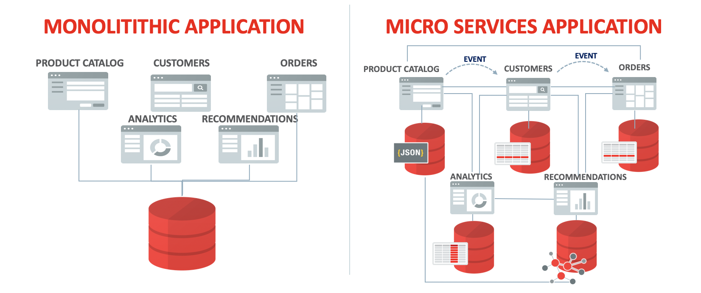
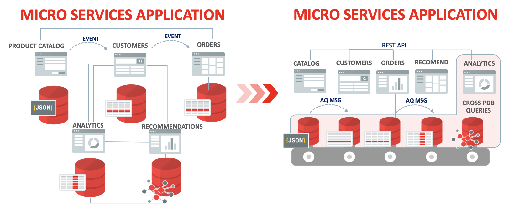
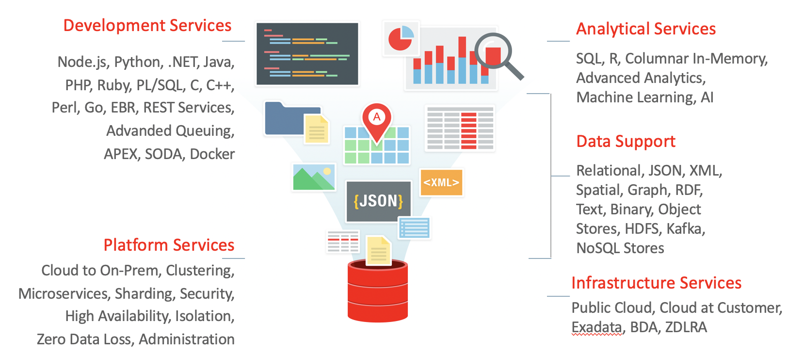

# 🚀 Lab 2: Microservices with Autonomous Database (ATP)

In this lab we will build a small RESTful API with a lightweight [Helidon microservice](https://helidon.io). We will connect the microservice to [Oracle Autonomous Transaction Processing DB](https://www.oracle.com/database/what-is-autonomous-database.html) and deploy our application to Kubernetes.

## Table of contents

* [Prerequisites](#prerequisites)
* [Microservices and Oracle Database](#microservices-and-oracle-database)
* [Lab guide](#lab-guide)
   * [Access lab resources](#access-lab-resources)
   * [Blablabla](#blablabla)
   * [Some more steps](#some-more-steps)
* [Next steps](#next-steps)

## Prerequisites

- Docker runtime locally installed
- An Oracle Cloud Account to provision a cloud database. You can go to [cloud.oracle.com](https://cloud.oracle.com) and get a 300$ free trial.
- A Kubernetes cluster to deploy the microservice to (e.g. a [managed OKE cluster](https://docs.cloud.oracle.com/iaas/Content/ContEng/Concepts/contengoverview.htm))

## Microservices and Oracle Database

### Introduction to Microservices

Microservices have arguably become one of the most important architectural styles in software engineering. They can enable hyper-scaling, polyglot and fault-tolerant distributed software systems.

If you are not familiar with microservices be sure to check out [Martin Fowler's overview of microservices](https://martinfowler.com/articles/microservices.html). In short, the microservice architectural style is an approach to developing a single application as a suite of small services, each running in its own process and communicating with lightweight mechanisms, often an HTTP resource API. 



While independently deployable and scalable microservices can offer significant advantages compared to big monoliths, they may also introduce major challenges (consistancy, managibility, complexity to handle failure, etc).

### How does data management fit in?

Microservices typically prefer letting each service manage its own database, either different instances of the same database technology, or entirely different database systems - an approach called Polyglot Persistence. You can use polyglot persistence in a monolith, but it appears more frequently with microservices.

Such decentralized data management can have considerable downsides and risks:

- Different microservices might require different types of data structures (relational/SQL, non-relational/NoSQL, graph-based, document-based etc.)
- This can lead to a dispursed database landscape with many different technologies (e.g. MySQL, MongoDB, Neo4j etc.)
- The resulting overhead in maintainance, patching and managibility can be huge
- It becomes harder to secure the system as a whole, with many different database technologies involved
- Scalability may be difficult in situations where [eventual consistancy](https://martinfowler.com/articles/microservice-trade-offs.html#consistency) is not acceptable
- Additional considerations like high availabity, back-up strategies have not been made

The process of managing potentially hundreds, or thousands, of individual database instances within Docker containers, can become impractical and costly.

### Using a data persitance layer with microservices

In order to solve these issues we can introduce a data persistance layer. For every microservice that requires a persistant database, the data management layer will provide a database for the microservice.

This means that each microservice gets alligned with its own containerized database.



A data management layer to support a microservice-based application layer can offer the following advantages:

- Managebility is simplified
- It is much easier to secure the system by securing the data management layer
- Patching is simplified. All database containers can be kept at a similar patch level and patches can be applied in batches
- Back-up strategies and high availability can be handled at the persistance layer

### Oracle Autonomous Database as a data management layer for microservices

These advantages are amplified when using a managed database cloud service. 

Oracle Autonomous Database Cloud Service is an **ideal data management platform to support a microservice-based architecture** in the cloud for these reasons:

- A database can be provisioned manually or per infrastructure automation (API, Terraform, CLI, etc) in minutes
- The database is designed to secure itself by default. It is serverless and offers no OS or root access for users.
- No patching overhead, database patches are applied automatically.
- The autonomous database instance can scale elastically up/down from 1-128 CPU cores, without any downtime.
- Autoscaling can optionally be enabled.
- Back-ups are automatically created and managed
- Databases can be cloned (and later deleted) very easiliy for testing purposes
- Managed infrastructe in three data centres (availability domains) per region
- Support for lots of data structures: Oracle DB supports relational data, JSON, XML, spatial, graph, RDF,  text, binary, object stores, HDFS, Kafka and NoSQL stores



- If there is a need to run analytical queries Oracle Autonomous Database can also run queries across different database containers.

# Lab guide

## Access lab resources

To access the lab resources you can either clone this repository 

```shell
git clone git@github.com:alpsteam/autonomous-labs.git
cd autonomous-labs/lab-2/
```

or download the lab resources as a `.zip` file.

[Download lab resources](https://github.com/alpsteam/autonomous-labs/raw/master/lab-2/lab-2-resources.zip){: .btn .btn-primary .fs-5 .mb-4 .mb-md-0 .mr-2 } [View source code](https://github.com/alpsteam/autonomous-labs/tree/master/lab-2/lab-2-resources){: .btn .fs-5 .mb-4 .mb-md-0 }

## Blablabla

Should there be a need to highlight code it can be done like this.

```java

public class GreetService {
  @GET
  @Path("/greet")
  public String getMsg() {
    return "Hello World!";
  }
}

```

## Step-by-Step Guide

### Run Docker Image
In our lab we will need to run docker inside docker, this requires some specific startup flags. Caution: This is a serious security issue if you run it like this outside a safe lab environment. You will need to run docker inside the docker container with sudo.

Mac/Linux:

```
docker run -ti --rm --privileged -v /var/run/docker.sock:/var/run/docker.sock maxjahn/priceservice-standalone:1.0
```

Windows:

```
docker run -ti --rm --privileged -v //var/run/docker.sock:/var/run/docker.sock maxjahn/priceservice-standalone:1.0
```


### OCI CLI setup

```
sh ./src/main/resources/oci_setup.sh

```

Add the public key you get as output from the script as API key in OCI console.


### Get Autonomous Database Wallet via OCI CLI

```
sh ./src/main/resources/get_wallet.sh [OCID of your Autonomous Database]
```

### Build Service

```
mvn package

cd target && sudo docker build -t priceservice:1.0 .
```

### Test Service locally

```
java -jar target/priceservice.jar 

curl -X GET http://localhost:8080/price

curl -X GET http://localhost:8080/price/1001
```


## Some more steps

......

## Next steps

Here we can provide some next steps. We should give ideas what the lab participant can do next with the service. Oracle has lots of good resources (blogs etc.) thank we can link. 


