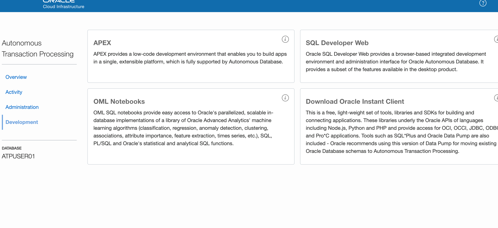
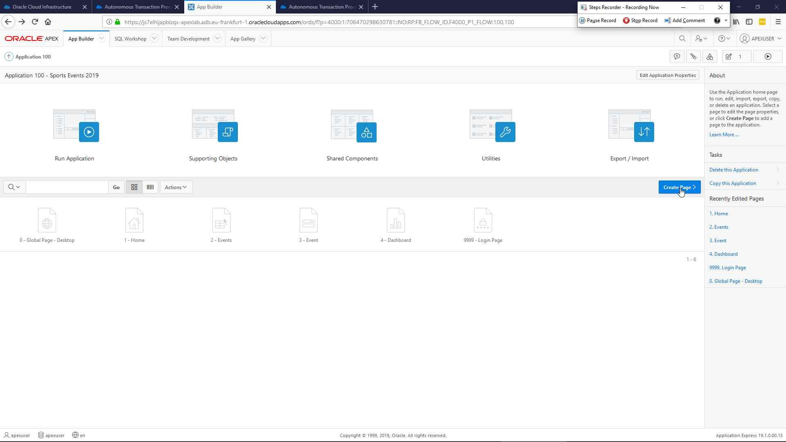

# Lab 3: Autonomous LAB, APEX Hands-On

Build your first low code application with Oracle APEX on Oracle Autonomous Transaction Processing.

## Table of contents

* [Prerequisites](#prerequisites)
* [Introduction to your lab](#introduction-to-your-lab)
* [Lab guide](#lab-guide)
   * [Access lab resources](#access-lab-resources)
   * [Step-by-Step Guide](#step-by-step-guide)

## Prerequisites

- An Oracle Cloud Account
- Right permissions

## Introduction to your lab

In this lab we will build APEX Application.

# Lab guide

## Access lab resources

The only resource that you will need for this lab (except an Oracle Cloud Account) is the [sports2019.csv](https://github.com/alpsteam/autonomous-labs/blob/master/lab-3/sports2019.csv) file. You can download the file as a `.zip` below.

[Download .zip file](https://github.com/alpsteam/autonomous-labs/raw/master/lab-3/lab-3-resources.zip){: .btn .btn-primary .fs-5 .mb-4 .mb-md-0 .mr-2 } 

## Step by Step Guide

Login to Application Using

Press Next and choose your
Username : userXX (where XX represents 01 .. 10)
Password  : aaddbbllaabbU[xx] where XX represents 01..10)

Choose Autonomous Transaction Databases, Create a Database

Once done, choose the user corresponding Compartment

Choose as Display Name and Database Name your username: Atpuser01, atpuser02

Keep the pre-selected options on ATP and server-less, number of oCPUs and storage as predefined

Use your password of choice or the one you used as login password (aaddbbllaabbU[01-10] )

Press Create Autonomous Database, this step takes approximately 3-5 minutes
Then choose Service Console:

Choose Development on the left part of the screen.

Choose APEX, you will be prompted for yet another password. 

Now, create a Workspace:

To keep it simple, use again the user username and password, workspace name defaults to username:

After a few seconds you see a screen like that: Here, it is important to listen to the instructors and log out of this screen to re-login to the user just being created.

Re-enter your credentials:

Tataaahhhh: you should see this screen now:

Choose App Builder and continue

Choose `Create` and you see this:

We will share a file via slack during the run of this session with you, download that file to your laptop location of your choice. It`s a small xls/csv file called sports2019.csv

Open the file

Choose `Configure` to customize the data load

Remove COLUMN_, COL07 & COL08 from the list of columns to load and `SAVE changes`

Enter Table Owner (it's the user you created), enter Table Name SPORTS_EVENTS, leave Error Table Name empty and choose `Load Data`

You get a confirmation then choose `Continue to Create Application Wizard`

Enter `Sports Events 2019` as Name and choose `Create Application`

Application gets created, choose `Run Application`

Provide Username and Password to start the application (it's the user you created)

All created automatically. Keep layout in mind for later. Choose `Events`

Application is fully functional. Choose an event to edit it.

After applying the change you will see it in the events list

Choose `Dashbord` to see a chart. Chart was created automatically based on the data loaded

We create a new page in the application to see the Sports Events in a calendar. Choose `Create Page`

From the Components list choose `Calendar` then `Next`

Enter Page Name `Calendar` then choose `Next`

Choose `Create a new navigation menu entry` then `Next`

Enter Table / View Owner (it's the user you created) and Table / View Name `SPORTS_EVENTS (table)` then `Next`

Enter Display Column `SPORT`, Start Date Column `START_DATE`, End Date Column `END_DATE` then choose `Create`

Choose `Save and Run` in the top right corner to test the new page

Et voilá, calendar page with a navigation menu entry on the left. On mouse-over of an event you see some details but we like to see and edit all details. For that return to Page Designer

In the Navigator pane (left) choose `Attributes` under Region ` Content Body ` Calendar. In the Attributes pane (right) choose `View / Edit Link`

In Page enter `3` (Event), for Set Items enter Name `P3_ID` and Value `ID` then choose `Ok`

`Save and Run` the page

If you choose an event you are now able to edit the details of the event.

We add a Pie-Chart to the Dashboard Page. In the Navigator pane choose `Sport` under Region `Content Body`, from hamburger menu choose `Duplicate`

In the Navigator page choose `Attributes` under Region ` Content Body ` Sport (2nd), in the Attributes pane enter Chart Type `Pie`

In the Navigator page choose `Series 1` under Region ` Content Body ` `Sport (2nd) ` Series, in the Attributes pane enter Label Show `Yes` and Display As `Label ` Percentage (Value)`

`Save and Run` the page, the Dashboard page contains 2 Charts.
Now remember the content of the homepage, it contains an Event and Dashboard item. 

Navigate to the Page Designer of the page Home. In the Navigator pane choose tab `Page Shared Components` (right)

In the Navigator pane choose `Page Navigation` under Lists. In the Lists pane (right)  choose `Edit Component`

Choose `Create Entry`

Enter Page `5` (Calendar) and List Entry Label `Calendar`, choose an Image/Class of your choice. Choose `Create List Entry`

Run the application

Congratulation! You successfully completed the autonomous Lab APEX.

 

