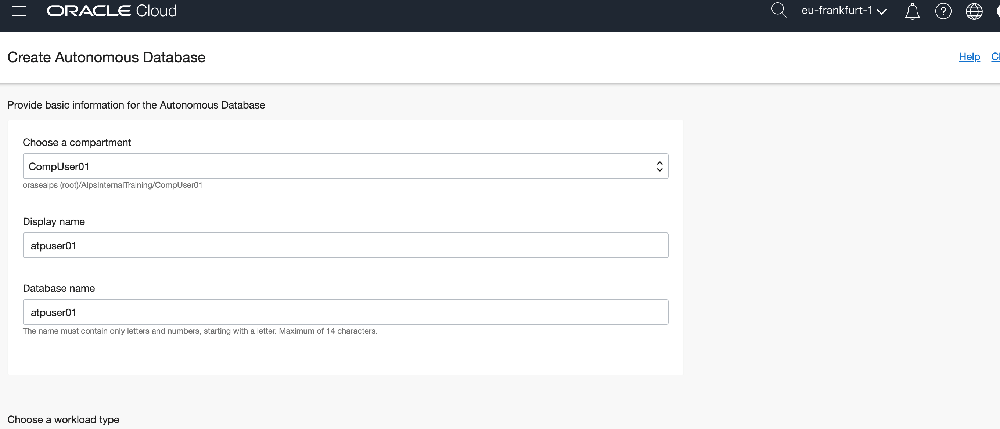

# 🚀 Lab 3: APEX on Autonomous DB (ATP)

Build your first low code application with Oracle APEX on Oracle Autonomous Transaction Processing.

## Table of contents

* [APEX Lab as Youtube Video](#apex-lab-as-youtube-video)
* [Prerequisites](#prerequisites)
* [Introduction to APEX and Autonomous DB](#introduction-to-apex-and-autonomous-db)
* [Lab guide](#lab-guide)
   * [Access lab resources](#access-lab-resources)
   * [Step-by-Step Guide](#step-by-step-guide)

## APEX Lab as Youtube Video

You can view the contents of this lab as a Youtube video by clicking the thumbnail below.

## Prerequisites

- An Oracle Cloud Account
- Web browser
- 60-90 minutes to complete the lab

## Introduction to APEX and Autonomous DB

### What is Oracle APEX?

[Oracle Application Express (APEX)](https://apex.oracle.com/) is a low-code development platform that enables you to easily build enterprise apps, with world-class features, that can be deployed anywhere.

> **Build scalable, secure enterprise apps. Fast.**

Learning Oracle APEX is easy and it won't take long to pick up the basics. Check out the [learning section](https://apex.oracle.com/en/learn/) of APEX. For this lab, we don't require any prior experience with Oracle APEX.

### What is Oracle Autonomous DB?

With Oracle Autonomous Database Cloud services, you can develop and deploy on a preconfigured, **fully managed, and secured  environment** (database including services like Oracle APEX) without any of the hassles of upkeep or manual maintenance.

Oracle Autonomous Transaction Processing and Autonomous Data Warehouse deliver self-driving, self-securing, self-repairing database services that scale instantly to meet the demands of mission critical applications.

No IT skills required, meaning you don't need to be a database administrator, network engineer, security expert, or systems architect. Oracle takes care of it all, from configuration, tuning, backup, to patching, encryption, scaling and more, so that you can concentrate on solving business problems.

# Lab guide

## Access lab resources

The only resource that you will need for this lab (except an Oracle Cloud Account) is the `sports2019.csv` file. You can download the file as a `.zip` below.

[Download .zip file](https://github.com/alpsteam/autonomous-labs/raw/master/lab-3/lab-3-resources.zip){: .btn .btn-primary .fs-5 .mb-4 .mb-md-0 .mr-2 } [View .csv file](https://github.com/alpsteam/autonomous-labs/tree/master/lab-3/sports2019.csv){: .btn .fs-5 .mb-4 .mb-md-0 }

## Step by Step Guide

Head to the [Oracle Cloud login page](https://cloud.oracle.com/en_US/sign-in) and enter your tenancy name.

Enter your login credentials for your tenancy.

From the hamburger menu in the top left, choose `Autonomous Transaction Processing`. The, create a database.

Once done, choose the corresponding compartment.

Choose a display name and database name for ATP instance.

Keep the pre-selected options on ATP and choose `serverless`, number of OCPUs and storage as predefined.

Choose a password with strong security for the database instance.

Press `Create Autonomous Database`, this step takes approximately 3-5 minutes. 

Then choose `Service Console`.

Choose `Development` on the left part of the screen.

Choose APEX, you will be prompted for yet another password. Enter your database password that you chose earlier.

Now, create a workspace.

Choose a workspace name, username and password to begin working in APEX.

After a few seconds you see a screen like that: Here, it is important to listen to the instructors and log out of this screen to re-login with the new workspace and new user that was just created.

Re-enter your credentials.

Tadaaahhh, you should see this screen now.

Choose `App Builder` and continue.

Choose the big `Create` button and you see this.

Upload the `sports2019.csv` file that you previously downloaded [here](https://alpsteam.github.io/autonomous-labs/lab-3/lab-3.html#access-lab-resources).

Afterwards you should see this screen.

Choose `Configure` to customize the data load.

After the `Configure` screen has opened, switch to the `Columns to load` tab. Afterwards remove the columns `COLUMN_`, `COL007` and `COL008` by unticking them and `Save changes`.

Enter table owner (it's the user you created for the workspace), enter a table name `SPORTS_EVENTS`, leave `Error Table Name` empty and choose `Load Data`.

You get a confirmation then choose `Continue to Create Application Wizard`.

Enter `Sports Events 2019` as Name and choose `Create Application`.

Application gets created, choose `Run Application`.

Provide your username and password to start the application (it's the user you created for the workspace).

All created automatically. Keep layout in mind for later. Choose `Events`.

Application is fully functional. Choose an event to edit it.

After applying the change you will see it in the events list.

Choose `Dashbord` to see a chart. Chart was created automatically based on the data loaded.

We create a new page in the application to see the Sports Events in a calendar. Choose `Create Page`.

From the components list choose `Calendar` then `Next`.

Enter page name `Calendar` then choose `Next`.

Choose `Create a new navigation menu entry` then `Next`

Enter table / view owner (it's the user you created) and table / view name `SPORTS_EVENTS (table)` then `Next`.

Enter Display Column `SPORT`, Start Date Column `START_DATE`, End Date Column `END_DATE` then choose `Create`

Choose `Save and Run` in the top right corner to test the new page

Et voilá, calendar page with a navigation menu entry on the left. On mouse-over of an event you see some details but we like to see and edit all details. For that return to Page Designer

In the Navigator pane (left) choose `Attributes` under Region ` Content Body ` Calendar. In the Attributes pane (right) choose `View / Edit Link`

In Page enter `3` (Event), for Set Items enter Name `P3_ID` and Value `ID` then choose `Ok`

`Save and Run` the page

If you choose an event you are now able to edit the details of the event.

We add a Pie-Chart to the Dashboard Page. In the Navigator pane choose `Sport` under Region `Content Body`, from hamburger menu choose `Duplicate`

In the Navigator page choose `Attributes` under Region ` Content Body ` Sport (2nd), in the Attributes pane enter Chart Type `Pie`

In the Navigator page choose `Series 1` under Region ` Content Body ` `Sport (2nd) ` Series, in the Attributes pane enter Label Show `Yes` and Display As `Label ` Percentage (Value)`

`Save and Run` the page, the Dashboard page contains 2 Charts.
Now remember the content of the homepage, it contains an Event and Dashboard item. 

Navigate to the Page Designer of the page Home. In the Navigator pane choose tab `Page Shared Components` (right)

In the Navigator pane choose `Page Navigation` under Lists. In the Lists pane (right)  choose `Edit Component`

Choose `Create Entry`

Enter Page `5` (Calendar) and List Entry Label `Calendar`, choose an Image/Class of your choice. Choose `Create List Entry`

Now, run the application.

**Congratulations!** You have successfully completed the `Autonomous Lab 3: APEX`.

 

